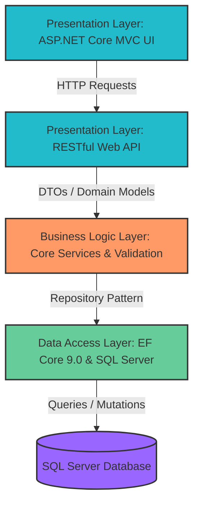

# MyShipping

“Full‑stack shipping management platform built with ASP.NET Core MVC, featuring secure user management, multi‑gateway payments, real‑time notifications, and analytics.”

**A full-stack shipping management platform with secure authentication, multi-gateway payment processing, and real-time notifications.**

## Overview

MyShipping is an enterprise-grade shipping management system designed to streamline shipment tracking, payment processing, and user management. Built with **ASP.NET Core** and **Razor Views**, the platform provides a robust backend API and responsive web interface for shipping logistics management.

### Key Capabilities

✅ **User Management** - Secure authentication with ASP.NET Identity  
✅ **Payment Integration** - Multi-gateway support (PayPal, Stripe)  
✅ **Shipment Tracking** - Real-time shipment status monitoring  
✅ **Admin Dashboard** - Comprehensive management interface  
✅ **Email Notifications** - SendGrid integration for communications  
✅ **RESTful API** - WebApi backend for third-party integrations  
✅ **Localization** - Multi-language support (Arabic, English)  
✅ **Data Persistence** - Entity Framework Core with SQL Server

## 🏗️ Architecture & Project Structure

The project follows an enterprise-grade **N-Tier Layered Architecture** pattern to enforce a strict separation of concerns, ensuring high scalability, maintainability, and testability.

### Architectural Blueprint



### Repository Layout

- **`UI/`**: Presentation layer handling the responsive Razor Views and localized web frontend.
- **`WebApi/`**: RESTful API endpoints powering secure business client and third-party communications.
- **`Business/`**: Core Business Logic Layer (BLL) housing state machine lifecycles and business workflows.
- **`DataAccessLayer/`**: Data Access Layer (DAL) managing Entity Framework Core 9.0 contexts, migrations, and repository implementations.
- **`Domains/`**: Shared entities, DTOs, and foundational data structures mapped across layers.
- **`WebApi.Tests/`**: Automated xUnit testing suites ensuring robust webhook and computation flows.

## 🚀 Tech Stack

### Backend

- **Framework:** ASP.NET Core 9.0
- **Language:** C# 13
- **Database:** SQL Server / Entity Framework Core
- **Authentication:** ASP.NET Identity with JWT
- **UI Framework:** Razor Views

### Payment Processing

- **PayPal Integration** - OAuth 2.0, webhook verification
- **Stripe Integration** - Payment processing & webhooks
- **Custom Gateway Factory** - Extensible payment architecture

### Third-Party Services

- **SendGrid** - Email notifications
- **Entity Framework Core** - ORM & migrations
- **xUnit** - Unit testing framework

### Front-End

- **Razor Views** - Server-side rendering
- **Bootstrap** - Responsive UI
- **JavaScript** - Client-side functionality
- **Localization** - Resource-based translations (Arabic, English)

---

## ⚡ Getting Started

### Prerequisites

- .NET 9.0 SDK or higher
- Visual Studio 2022
- SQL Server (LocalDB or remote instance)
- API keys for payment gateways (optional for development)

---

## 🔗 Related Resources

- [Portfolio Repository](https://github.com/sami-amara/Portfolio) – Overview of my skills, CV, and other projects.
- [CV Repository](https://github.com/sami-amara/CV-SamiAmara) – Professional CV and career highlights.
- [LinkedIn Profile](https://www.linkedin.com/in/sami-amara-032b70416/) - Overview LinkdIn 


### Installation

1. **Clone the repository**
   ```bash
   git clone https://github.com
   ```
